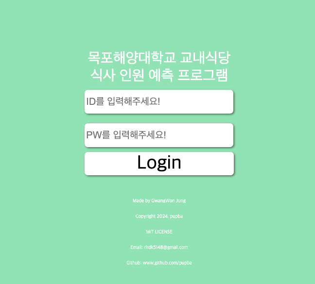
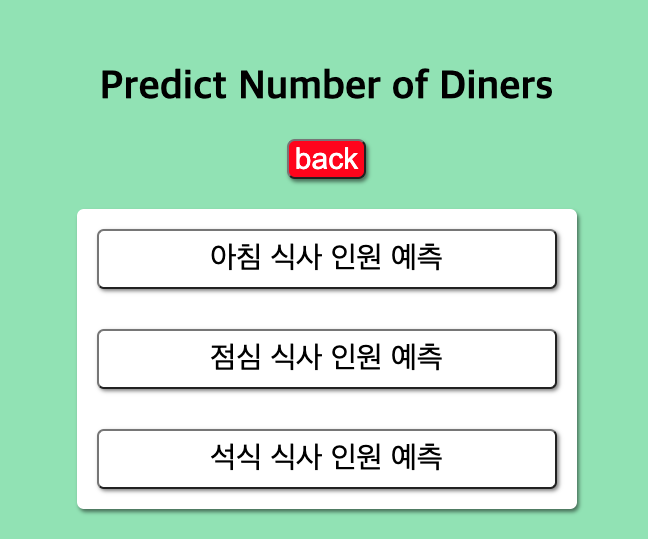
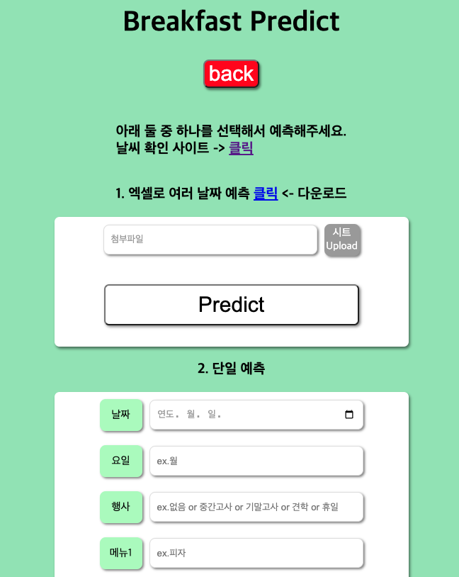
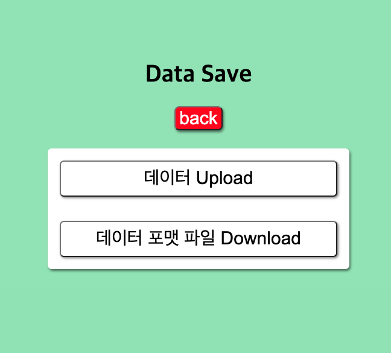
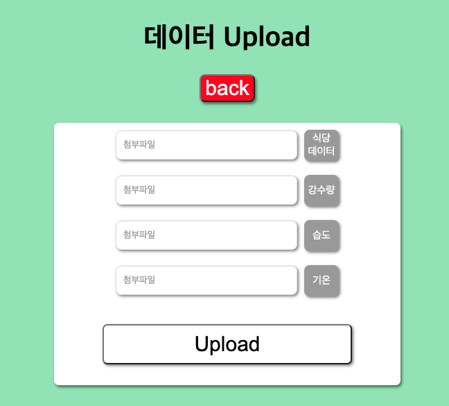

# User Front & API Server

-   FastAPI API 서버와 Jinja Frontend 구축
    
     

## Requirements

Python: 3.9.0
Jinja2: 3.1.3
uvicorn: 0.27.1
SQLAlchemy: 2.0.20
psycopg2-binary: 2.9.9(MacOS)
fastapi: 0.110.0
pydantic: 2.6.3
starlette: 0.36.3
jose: 1.0.0(JWT)
python-jose: 3.3.0(JWT)
pandas: 2.2.1
openpyxl: 3.1.2
pycrypto: 2.6.1
pycryptodome: 3.20.0

## PreView

### Main Page

**Login** 

**Main** 

### Predict

**predict**

**predict-breakfast**

-   나머지는 이름만 다름

### Upload & DownLoad

**Save** 

**Upload** 

**Download** 

